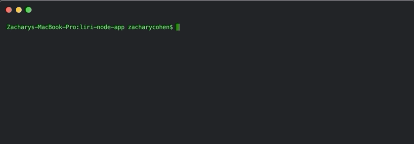
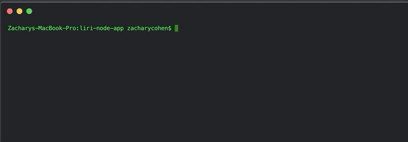

# LIRI-BOT 
LIRI is a command line node app that gives you data based off the following commands:

spotify this:
requests the spotify API for :
Artist(s)
The song's name
A preview link of the song from Spotify
The album that the song is from

concert this:
requests the Bands in Town Artist Events API for :
Name of the venue
Venue location
Date of the Event (use moment to format this as "MM/DD/YYYY")

movie this:
requests the OMDB API for :
Title of the movie.
Year the movie came out.
IMDB Rating of the movie.
Rotten Tomatoes Rating of the movie.
Country where the movie was produced.
Language of the movie.
Plot of the movie.
Actors in the movie.

do what it says:
LIRI will use the text from “random.txt” and call and run Spotify-this-song for “I want it That way”.

